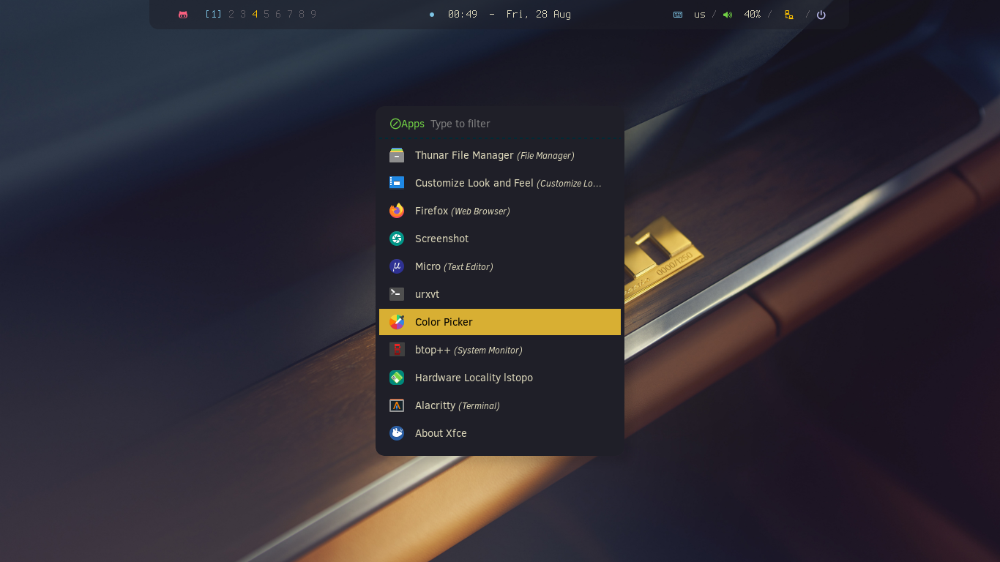
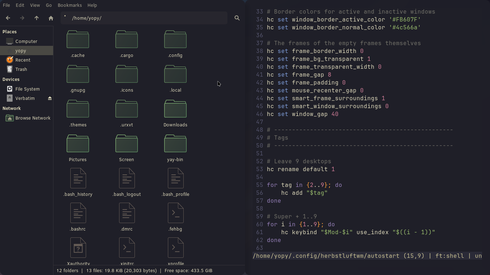
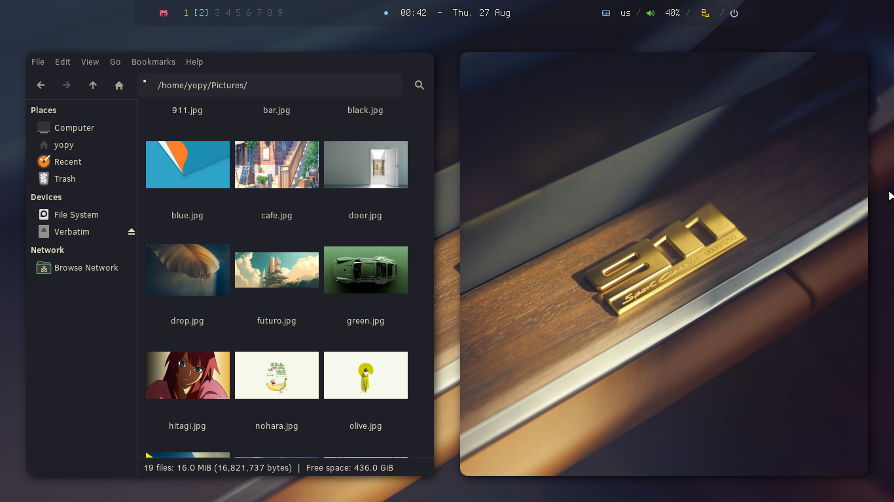
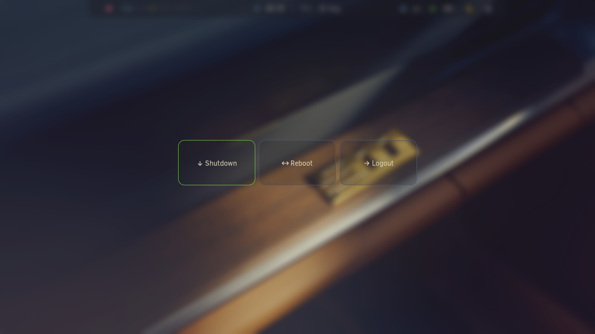

<div align="center">

### Herbstluftwm 🐧 Dotfiles


### 2 modes




</div>

### Turbo Theme


#### 2 operating modes

> Polybar is visible > gaps in 40 > normal mode  
> Polybar is hide > `super + b ` > gaps in 0 > working mode

| **Window Manager**  | `hlwm`  |
| :----------------------------------- | :------------------------ |
| **Status bar**                       | `polybar`                 |
| **Terminal**                         | `alacritty`               |
| **Launcher**                         | `rofi`                    |
| **Wallpaper**                        | `feh`                     |
| **Compositor**                       | `picom`                   |
| **Screenshot**                       | `maim`                    |
| **Viewer**                           | `imv`                     |

#### Fonts / Theme

**Symbols Nerd Font** - icons, interface, development.  
**JetBrains Mono** - system font and interface.

**Clear Sans 10** - System Font  
**Kanagawa** - Theme  
**Gruvbox** - Icons

### Installation

#### 1. Boot to the Arch iso

```
archinstall

on the step - profile - select > desktop > minimal
```

#### 2. After installing > reboot and update system

```
sudo pacman -Syu

sudo pacman -S \
    xorg-server \
    xorg-xinit \
    xorg-xrandr \
    xorg-xset \
    xorg-xsetroot
```

#### 3. Installing Herbstluftwm and basic utilities

```
sudo pacman -S \
herbstluftwm \
    alacritty \
    polybar \
    rofi \
    picom \
    feh \
    maim \
    slop \
    xclip \
    dunst \
    i3lock
```

Give execution rights to configuration scripts:

```
chmod +x ~/.config/herbsluftwm/autostart
chmod +x ~/.config/polybar/launch.sh
chmod +x ~/.config/polybar/hlwm-polybar/hlwm-tags.sh
```

#### 4. Installing basic applications and dependencies

```
sudo pacman -S \

alacritty \
   kitty \
   foot \
   micro \
   mousepad \
   firefox

thunar \
   thunar-archive-plugin \
   thunar-volman

fastfetch \
   mc \
   xarchiver \
   tumbler \
   btop

p7zip \
   unzip \
   zip \
   tar \
   atool

wget \
   git \
   curl \
   gvfs \
   udisks2 \
   ntfs-3g

xdg-utils \
   ripgrep \
   zoxide \
   xfce4-screenshooter

imv \
   celluloid \
   rhythmbox \
   imagemagick \
   ffmpeg

lxappearance \
   glib2 \
   gcolor3
```

#### 5. Installing FISH

```
sudo pacman -S \
fish \
   eza \
   fzf \
   fd

chsh -s $(command -v fish)
```

#### Home Structure

```text
~/
├── Pictures/
├── Screen/
├── icons/
├── themes/
├── .local/share/fonts/
└── .config/
    ├── herbstluftwm/
    ├── polybar/
    ├── rofi/
    └── picom/
```

#### Used Dots, Icons, Themes, Wallpapers

> [yojeero/config_linux](https://github.com/yojeero/config_linux)

#### Hide/show polybar + full desktop windows

> use keybinding
> `super + b `

#### Folder for screenshots

> Create folder **Screen** for saving screenshots via maim.

---

## Login TTY

> ### x11 wm

#### .xinitrc

> at the end > insert

```
exec herbstluftwm
```

#### config.fish

> at the end > insert

```
if status is-login
    if test -z "$DISPLAY" -a (tty) = "/dev/tty1"
        exec startx
    end
end
```

#### Login x11 wm

> Arch Linux > login > pass

---

> ### x11/wayland wm

#### .xinitrc

> at the end > insert

```
if [ -n "$1" ]; then
    exec "$1"
else
    exec herbstluftwm
fi
```

#### config.fish

> Interactive session selection when logging into TTY1

```
# ----------------------------------
# Interactive session TTY1
# ----------------------------------
if status is-interactive; and test (tty) = "/dev/tty1"
    echo "==================================="
    echo " Run HLWM or Sway:   "
    echo " [1] herbstluftwm (X11)           "
    echo " [2] Sway (Wayland)              "
    echo " [3] Stay in TTY      "
    echo "==================================="

    # Read the user's choice
    read -P "Select [1-3]: " choice

    switch $choice
        case 1
            echo "Start herbstluftwm (X11)..."
            exec startx (which herbstluftwm)

        case 2
            echo "Start Sway (Wayland)..."
            set -gx XDG_CURRENT_DESKTOP sway
            set -gx XDG_SESSION_DESKTOP sway
            set -gx XDG_SESSION_TYPE wayland
            set -gx MOZ_ENABLE_WAYLAND 1
            set -gx QT_QPA_PLATFORM wayland

            exec sway

        case 3
            echo "Enter to TTY!"

        case '*'
            echo "Bad step. Stay in TTY."
    end
end
```

#### Login to x11/wayland wm

        ├── [1] herbstluftwm (X11)
        ├── [2] Sway (Wayland)
        └── [3] Stay in TTY
